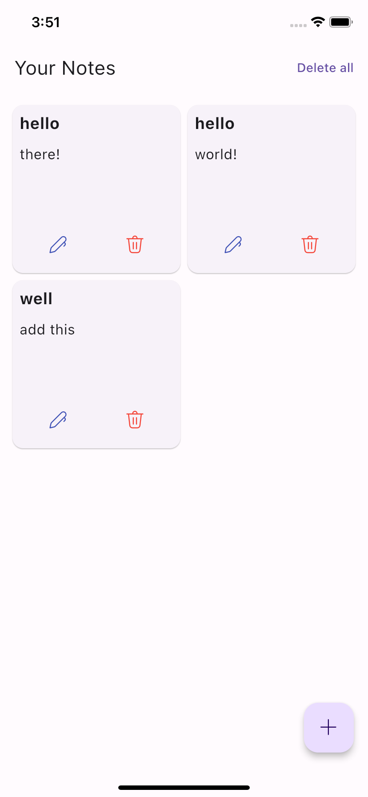
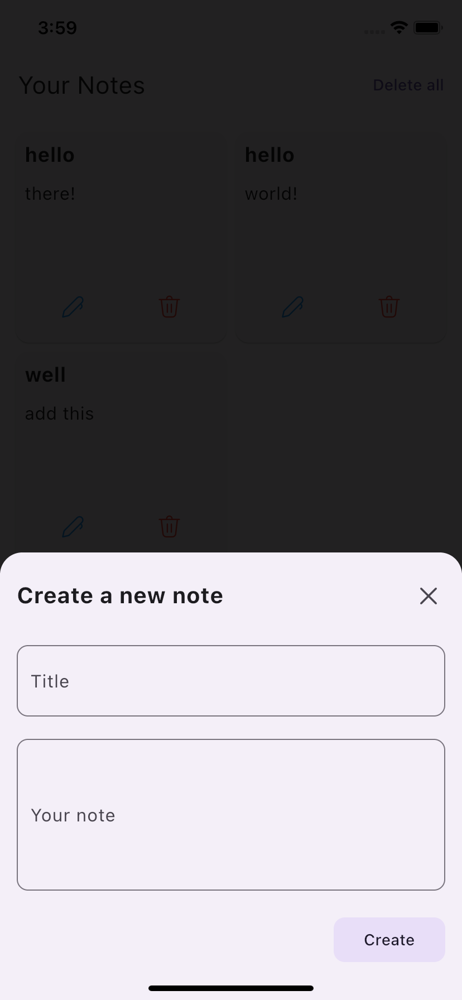
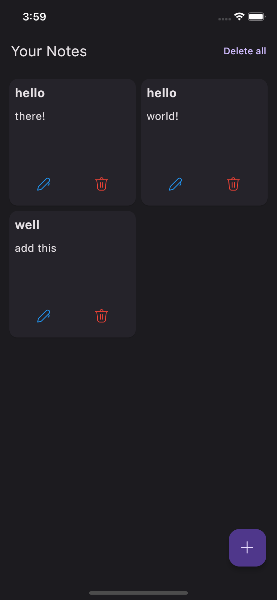
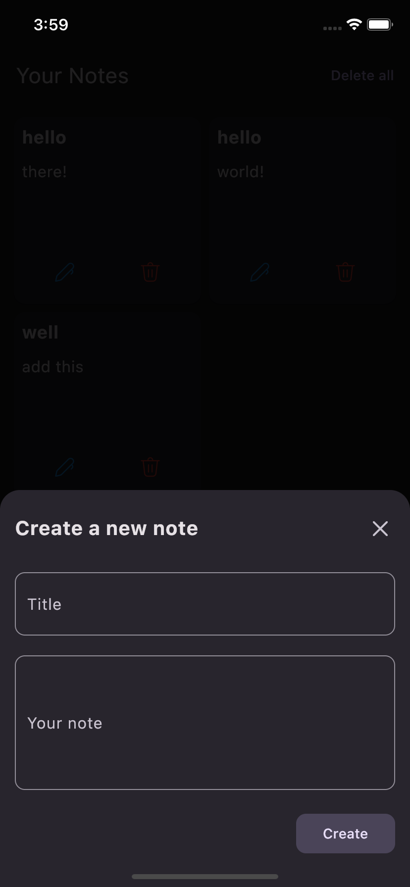

## Notes

A basic notes app made with Flutter using sqflite package.

#### Light Mode

   

#### Dark Mode

   

## Features

- Add, view, edit, and delete notes.
- Each note has a title and a body.
- Data is persisted locally using SQLite database.
- Simple and intuitive user interface.

## Getting Started

Follow the instructions below to run the Notes_Making app on your local machine.

### Prerequisites

- Flutter SDK installed on your machine. See installation instructions [here](https://flutter.dev/docs/get-started/install).
- Android Studio or VS Code with Flutter extension for development.

### Installation

1. Clone this repository to your local machine: git clone https://github.com/M-l-byte/notemaker.git
2. Navigate to the project directory:
3. Install dependencies:
   ->sqflite: ^2.0.0+3(for using sqflite)
   -> path: ^1.8.0(for managing path directories)
4.flutter pub get
## Running the App

- Connect your Android or iOS device to your computer or start an emulator/simulator.
- Run the app using the following command:
flutter run
### Usage

- Upon launching the app, you will see a list of your notes (if any).
- To add a new note, tap on the floating action button (`+`).
- To view, edit, or delete an existing note, tap on the note in the list.
- To edit a note, tap on the edit icon in the app bar.
- To delete a note, tap on the delete icon in the app bar.

### Note

- The application data is persisted locally on the device using an SQLite database. No internet connection is required.
- Ensure you have read and write permissions on your device to save and access the database.
